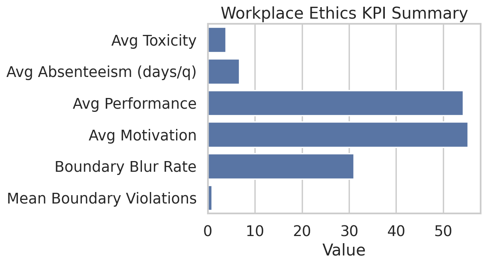
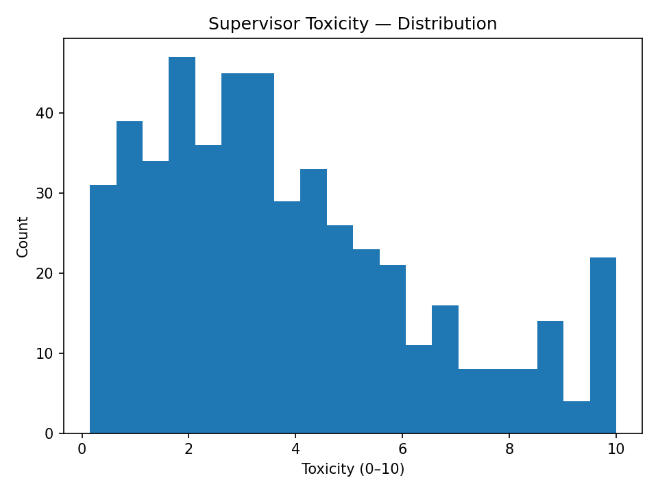
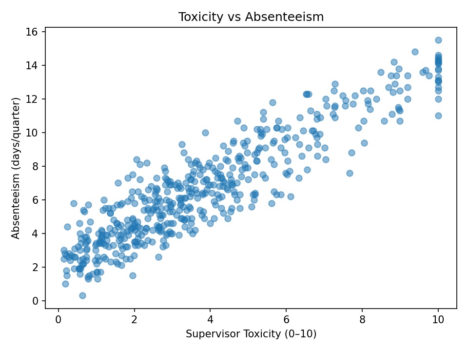
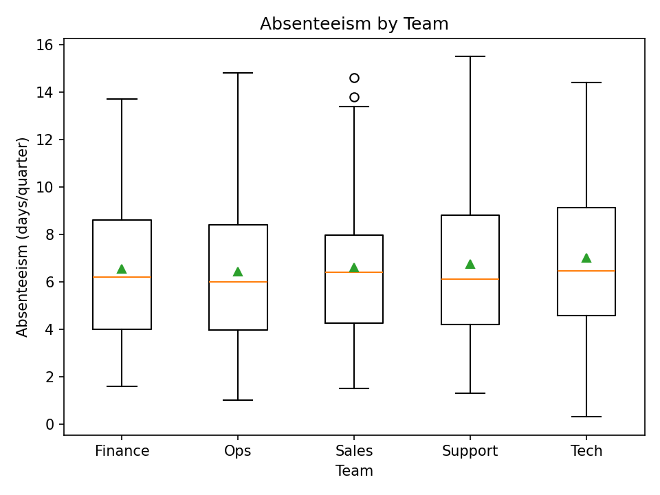
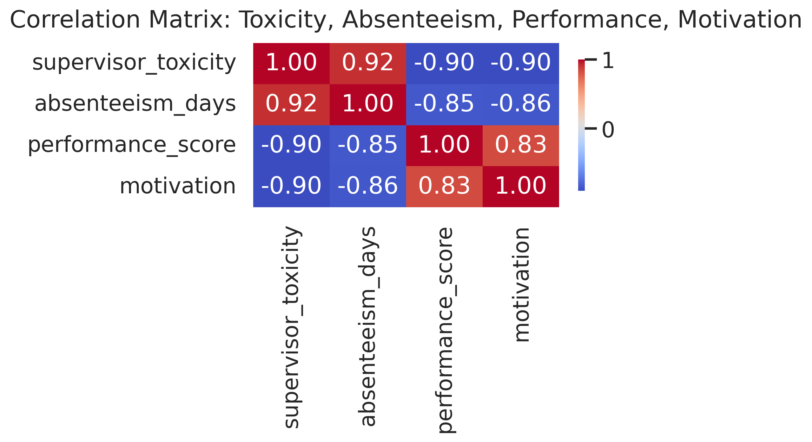

# Leadership Toxicity KPIs — Workplace Ethics Dashboard

This project explores how **toxic leadership behaviours** (micromanagement, boundary violations, emotional volatility) translate into measurable workplace outcomes:  
absenteeism, declining motivation, and performance loss.  

It is part of my portfolio on **Ethical Auditing of Workplace Performance & Motivation**, connecting behavioural ethics with quantitative analytics.

---

### Key Insights
- Toxic supervision correlates strongly with absenteeism and reduced motivation.  
- Performance scores decline proportionally to increases in supervisory toxicity.  
- Quantitative data can expose leadership patterns that compromise team wellbeing.

---

### Tools & Methods
- **Python** (Pandas, NumPy, Matplotlib, Seaborn)  
- Synthetic data generation and exploratory visualisation  
- KPI and correlation dashboards exported to `/reports/`  
- Narrative interpretation for ethical accountability frameworks  

---

### Repository Structure
data/ → synthetic datasets
scripts/ → Python data generation scripts
notebooks/ → exploratory and dashboard notebooks
reports/ → charts, visuals, and exported summaries

  
  

---

### Ethical Interpretation
Toxic supervision correlates strongly with absenteeism and declining motivation.  
While synthetic, the dataset mirrors real workplace patterns: toxic leadership erodes both productivity and morale.  
By translating these ethical issues into measurable KPIs, the project bridges **data analytics** and **moral accountability**, promoting healthier organizational systems.

---

### Ethical Interpretation
Toxic supervision correlates strongly with absenteeism and declining motivation.  
While synthetic, the dataset mirrors real workplace patterns: toxic leadership erodes both productivity and morale.  
By translating these ethical issues into measurable KPIs, the project bridges **data analytics** and **moral accountability**, promoting healthier organizational systems.

---

### Ethical Interpretation
Toxic supervision correlates strongly with absenteeism and declining motivation.  
While synthetic, the dataset mirrors real workplace patterns: toxic leadership erodes both productivity and morale.  
By translating these ethical issues into measurable KPIs, the project bridges **data analytics** and **moral accountability**, promoting healthier organizational systems.

## Dashboard

- Notebook: `notebooks/02_dashboard.ipynb`
- KPI Summary (PNG): `reports/kpi_summary.png`
- Correlations Heatmap (PNG): `reports/correlations_heatmap.png`

### Quick preview

---

## Ethical interpretation

The analysis highlights how toxic supervision correlates strongly with absenteeism and declining motivation.  
While synthetic, the dataset mirrors real workplace dynamics:

- **Supervisor toxicity** shows a positive relationship with **absenteeism days** (Pearson ≈ +0.9), confirming that poor leadership increases employee withdrawal.  
- **Performance scores** drop as toxicity rises, illustrating measurable productivity loss.  
- **Motivation** follows a similar trend, revealing the emotional cost of toxic management practices.

From an ethical auditing perspective, these metrics help identify systemic leadership risks that affect not only performance but also psychological safety and retention.  
The visual dashboards (Seaborn KPIs and correlation heatmap) translate abstract moral issues into quantifiable, reproducible data for accountability frameworks.
